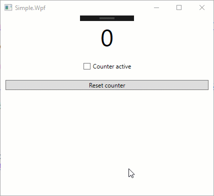
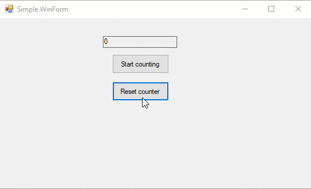

**N.B. ALL EXAMPLES ARE NOW IN VS2019 FORMAT**

# Simple

*Simple* examples have a rudimentary plc counter. We aimed to show basic manipulation with twins of the PLC. Accessing variables, reading, writing, displaying (WPF, and WinForms).

> REMARKS: It is possible to use WinForms to create the valuable applications. WinForm offers simple approach, you might be more familiar with the technology. On the other hand it requires more manual coding. If you want, however get the best from the framework consider starting with WPF. WPF offers very powerful data binding, styling, templates, effective work with components. WPF on the other hand has usually slowly climbing learning curve for classical programmers. It is however worth the effort.

# How it looks like

Inxton is reading the variable from PLC and displaying it
## Wpf

## WinForm

# Need help?

🧪 Or create an issue [here](https://github.com/Inxton/Feedback/issues/new/choose)

📫 We use mail too team@inxton.com 

🐤 Contact us on Twitter [@Inxton](https://twitter.com/inxtonteam)

📽 Checkout our [YouTube](https://www.youtube.com/channel/UCB3EcnWyLSsV5gqSt8PRDXA/featured)

🌐 For more info check out our website [INXTON.com](https://www.inxton.com/)

# Contributing

We are more than happy to hear your feedback, ideas!
Just submit it [here](https://github.com/Inxton/Feedback/issues/new/choose)  

# License
tldr
> Developers are encouraged to use this project -  free of charge, although when you want to use it in production enviroment you need to go to  [INXTON.com](https://www.inxton.com/) and purchase a licence.

to make our lawyers happy - read the whole licence agreement [here](https://github.com/Inxton/about/blob/master/license.md)

---
Developed with ♥ at [MTS](https://www.mts.sk/) - putting the heart into manufacturing.
 
